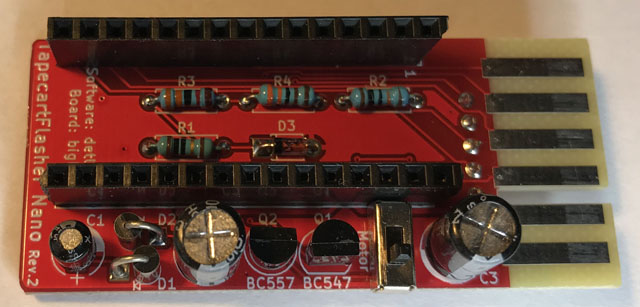
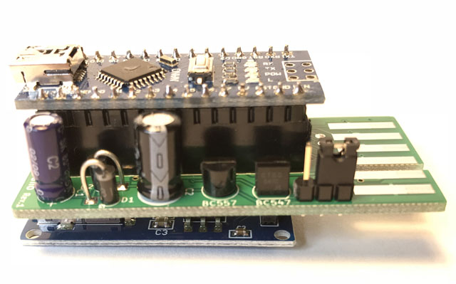

# TapecartFlasher Nano

This is a shield for Arduino Nano and compatible boards to be used with the software from the [TapecartFlasher project](https://github.com/detlefgerhardt/TapecartFlasher). It allows fast and easy transfer of data from a PC or a connected micro SD card to a [Tapecart](https://github.com/ikorb/tapecart) device. More details are available on [hackup.net](https://www.hackup.net/tag/tapecartflasher/).

